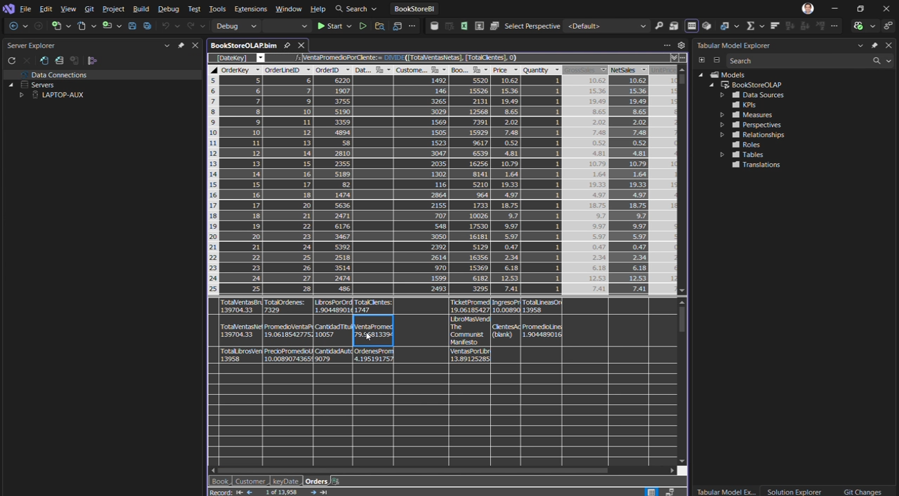

# miav-mod4-proy-db

Base de datos elegida: `Bookstore.bak`.

**Estructura**
- `bookstore/bookstoreDW/` proyecto SSDT del Data Warehouse.
- `bookstore/bookstoreOLTP/` proyecto SSDT del OLTP (incluye `db/schema`).
- `bookstore/bookstoreETL/` proyecto SSIS con paquetes ETL.
- `bookstore/BookStoreBI.slnx` solución principal.

**Publicación (bookstoreDW)**
1. Abrir `bookstore/BookStoreBI.slnx`.
2. Build del proyecto `bookstoreDW`.
3. Publish a una instancia local.
   - Instancia default: usar `.` o `(local)`.
   - Instancia con nombre: `.\SQLEXPRESS` (o la que corresponda).

**ETL (SSIS)**
- Los paquetes usan Windows Authentication.
- Ajustar `Server name` según tu instancia local (`.` recomendado para default).

**OLAP (BookStoreOLAP)**
Paso a paso (según `bookstore/BookStoreOLAP/BookStoreOLAP.bim` y `bookstore/BookStoreOLAP/BookStoreOLAP.smproj`):
1. Se creó un proyecto Tabular `BookStoreOLAP` con modelo `SemanticModel` (compatibility level 1200).
2. Se configuró un origen de datos SQL Server hacia `bookstoreDW` con autenticación integrada. En el archivo actual apunta a `laptop-aux` y usa impersonación `laptop-aux\agustin`; ajustar a tu servidor.
3. Se importaron las tablas del DW con particiones `SELECT *`: `DimBook`, `DimCustomer` (renombrada a `Customer`), `DimDate` y `FactOrders`.
4. Se ocultaron columnas técnicas en `Customer` y se creó `CustomerFullName = CONCATENATE(FirstName, " ", LastName)`.
5. En `FactOrders` se crearon columnas calculadas `GrossSales`, `NetSales` y `UnitPrice` basadas en `Quantity` y `Price`.
6. Se definieron relaciones de `FactOrders` con `DimBook`, `Customer` y `DimDate` por sus claves.
7. Se definieron medidas DAX de ventas, clientes, libros y comparativas temporales.
8. Se organizaron perspectivas para consumo: `Ventas`, `Análisis de Clientes`, `Análisis de Libros`, `Comparativa Temporal`.
9. El despliegue está configurado para `localhost` en la base `BookStoreOLAP` con modo `InMemory`.

**Columnas calculadas (DAX)**
- `Customer[CustomerFullName] = CONCATENATE(Customer[FirstName], " ", Customer[LastName])`
- `FactOrders[GrossSales] = FactOrders[Quantity] * FactOrders[Price]`
- `FactOrders[NetSales] = FactOrders[Quantity] * FactOrders[Price]`
- `FactOrders[UnitPrice] = FactOrders[Price]`

**Medidas DAX**
- `TotalVentasBruto = SUM(FactOrders[GrossSales])`
- `TotalVentasNetas = SUM(FactOrders[NetSales])`
- `TotalLibrosVendidos = SUM(FactOrders[Quantity])`
- `TotalOrdenes = DISTINCTCOUNT(FactOrders[OrderID])`
- `PromedioVentaPorOrden = DIVIDE([TotalVentasNetas], [TotalOrdenes], 0)`
- `PrecioPromedioUnitario = AVERAGE(FactOrders[UnitPrice])`
- `LibrosPorOrden = DIVIDE([TotalLibrosVendidos], [TotalOrdenes], 0)`
- `CantidadTitulosDistintos = DISTINCTCOUNT(DimBook[Title])`
- `CantidadAutores = DISTINCTCOUNT(DimBook[AuthorNames])`
- `TotalClientes = DISTINCTCOUNT(FactOrders[CustomerKey])`
- `VentaPromedioPorCliente = DIVIDE([TotalVentasNetas], [TotalClientes], 0)`
- `OrdenesPromedioPorCliente = DIVIDE([TotalOrdenes], [TotalClientes], 0)`
- `VentasAñoAnterior = CALCULATE([TotalVentasNetas], DimDate[Year] = MAX(DimDate[Year]) - 1) + 0`
- `CrecimientoVentas = [TotalVentasNetas] - [VentasAñoAnterior]`
- `PorcentajeCrecimiento = DIVIDE([CrecimientoVentas], [VentasAñoAnterior], 0)`
- `TicketPromedio = DIVIDE([TotalVentasNetas], [TotalOrdenes], 0)`
- `LibroMasVendido = CALCULATE(MAX(DimBook[Title]), TOPN(1, DimBook, [TotalLibrosVendidos], DESC))`
- `VentasPorLibro = DIVIDE([TotalVentasNetas], [CantidadTitulosDistintos], 0)`
- `IngresoPromedioPorLibro = DIVIDE([TotalVentasNetas], [TotalLibrosVendidos], 0)`
- `ClientesActivos = CALCULATE(DISTINCTCOUNT(FactOrders[CustomerKey]), Customer[IsActive])`
- `LibrosActivos = CALCULATE(DISTINCTCOUNT(FactOrders[BookKey]), DimBook[IsActive])`
- `TotalLineasOrden = COUNT(FactOrders[OrderLineID])`
- `PromedioLineasPorOrden = DIVIDE([TotalLineasOrden], [TotalOrdenes], 0)`

**Perspectivas**
- `Ventas`: `Customer[CustomerFullName]`, `DimDate[Year, MonthName, Quarter]`, `DimBook[Title, AuthorNames, PublisherName]`, medidas `TotalVentasNetas`, `TotalOrdenes`, `TotalLibrosVendidos`, `PromedioVentaPorOrden`.
- `Análisis de Clientes`: `Customer[CustomerFullName]`, `DimDate[Year, Quarter, MonthName]`, medidas `TotalClientes`, `VentaPromedioPorCliente`, `OrdenesPromedioPorCliente`, `TotalVentasNetas`, `ClientesActivos`.
- `Análisis de Libros`: `DimBook[Title, AuthorNames, PublisherName, LanguageName]`, `DimDate[Year, MonthName]`, medidas `TotalLibrosVendidos`, `LibrosPorOrden`, `CantidadTitulosDistintos`, `CantidadAutores`, `TotalVentasNetas`, `VentasPorLibro`, `LibroMasVendido`.
- `Comparativa Temporal`: `DimDate[Year, Quarter, MonthName]`, medidas `TotalVentasNetas`, `VentasAñoAnterior`, `CrecimientoVentas`, `PorcentajeCrecimiento`, `TotalOrdenes`.

**Evidencia de deploy (Analysis Services)**

**Interpretación**
- La captura corresponde a la fase posterior al deploy del proyecto tabular de Analysis Services.
- El panel derecho (`Tabular Model Explorer`) muestra que el modelo está cargado con sus componentes (`Data Sources`, `Measures`, `Perspectives`, `Relationships`, `Roles`, `Tables`).
- La vista de datos (grilla central) y los totales de medidas al pie confirman que el modelo fue procesado y que las medidas DAX están calculando correctamente (por ejemplo `TotalVentasNetas`, `TotalOrdenes`, `TotalLibrosVendidos`).

**Video explicativo (OLAP.mp4)**
El video muestra el flujo de ejecución y verificación de resultados del modelo OLAP.
1. Abrir `OLAP.mp4` (ubicado en la raíz del repo).
2. Seguir el recorrido de deploy del proyecto Analysis Services (`BookStoreOLAP`) en Visual Studio.
3. Verificar en la vista de datos que las tablas se cargan y que las medidas DAX calculan valores coherentes.
4. Confirmar en `Tabular Model Explorer` la presencia de `Data Sources`, `Tables`, `Relationships`, `Measures` y `Perspectives`.

**Mejoras recientes**
- Reestructuración del OLTP: `bookstoreOLTP.sqlproj` y `db/schema` movidos a `bookstore/bookstoreOLTP/`.
- Post-deploy: se incluye `scripts/PackageConfig.data.sql` (con `DimBook`).
- SPs robustos: `GetLastPackageRowVersion` devuelve 0 si no hay fila y `UpdateLastPackageRowVersion` hace upsert.
- `PackageConfig` ampliada con `LastLoadDate` e `IsActive`.
- `.gitignore` actualizado para evitar artefactos SSDT/SSIS.

**Integrantes**
- Eynar Pari
- Marcelo Garay
- Sheyla Camila Carrillo
- Agustin Acebo Pedraza

https://proyecto-bookstore-bi-p324eqw.gamma.site/
